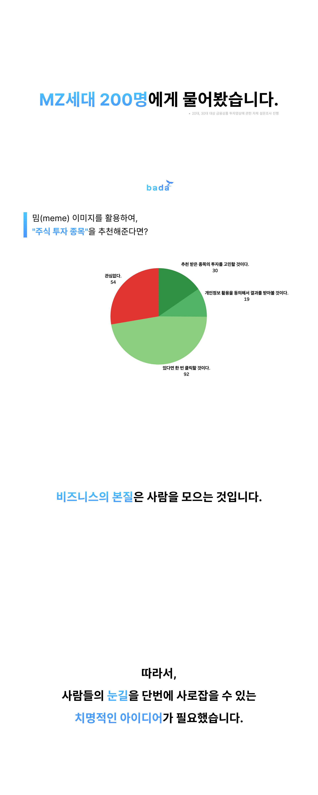
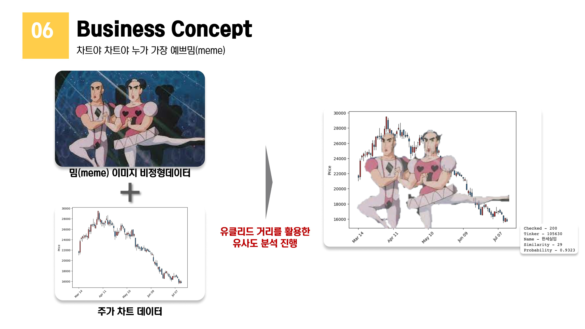
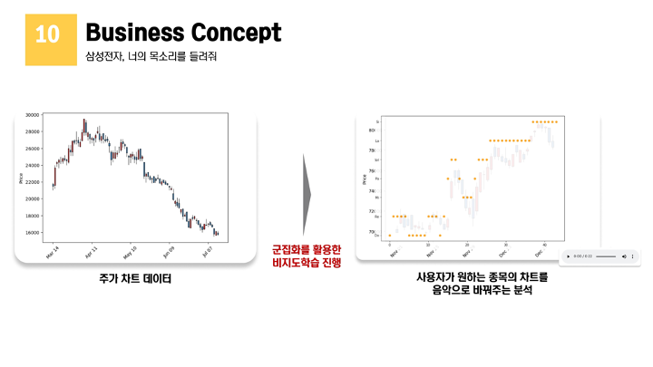

# find-stock-by-image

<h3 align="center"> 「 Stack 」  </h3>
<h5 align="center"> - AI -  </h5>

  
  
   

<h5 align="center"> - Dev -  </h5>

  
  
   
 
  
  
   
  
  
  
   

## Concept

 

## Screenshots
